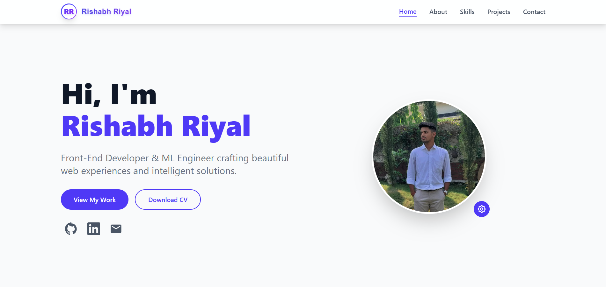

# Portfolio Website



A modern and responsive portfolio website built with React and Vite, showcasing professional experience, projects, and skills. This portfolio is designed to present my work and capabilities in an elegant and interactive way.

## 📌 About

This portfolio website serves as a dynamic and interactive platform to showcase my professional journey, technical expertise, and creative projects. Built with modern web technologies, it features:

- **Professional Showcase**: A comprehensive display of work experience, skills, and achievements
- **Project Gallery**: Interactive showcase of completed and ongoing projects
- **Responsive Design**: Seamlessly adapts to all devices - from mobile phones to desktop screens
- **Modern UI/UX**: Clean, intuitive interface with smooth animations and transitions
- **Performance Optimized**: Fast loading times and optimized assets for the best user experience

The website demonstrates both my technical abilities and my commitment to creating engaging, user-friendly web experiences.

## 🚀 Technologies Used

- React 19
- Vite 7
- TailwindCSS 4
- ESLint for code quality

## ✨ Features

- Modern and responsive design
- Smooth transitions and animations
- Profile avatar with hover effects
- Clean and maintainable code structure
- Optimized build process with Vite

## 🛠️ Installation

1. Clone the repository:
```bash
git clone https://github.com/rishabhriyal112/Portfolio-Website.git
```

2. Navigate to the project directory:
```bash
cd Portfolio-Website
```

3. Install dependencies:
```bash
npm install
```

## 🚦 Running the Project

### Development Mode
To run the project in development mode with hot-reload:
```bash
npm run dev
```

### Building for Production
To create a production build:
```bash
npm run build
```

### Preview Production Build
To preview the production build locally:
```bash
npm run preview
```

## 🧪 Linting
To run the linter:
```bash
npm run lint
```

## 📁 Project Structure

```
portfolio_website/
├── public/              # Static assets
│   ├── creation-ground.png
│   └── rr.png
├── src/                 # Source code
│   ├── assets/         # Project assets
│   │   └── rishabh01.jpg
│   ├── App.jsx         # Main application component
│   ├── App.css         # Component styles
│   ├── index.css       # Global styles
│   └── main.jsx        # Application entry point
├── index.html          # HTML entry point
├── vite.config.js      # Vite configuration
├── eslint.config.js    # ESLint configuration
└── package.json        # Project dependencies and scripts
```

## 🔧 Dependencies

### Main Dependencies
- React and React DOM
- TailwindCSS for styling

### Development Dependencies
- Vite for build tooling and development server
- ESLint for code linting
- Various React-specific ESLint plugins
- TypeScript types for React

## 🤝 Contributing

1. Fork the repository
2. Create your feature branch (`git checkout -b feature/amazing-feature`)
3. Commit your changes (`git commit -m 'Add some amazing feature'`)
4. Push to the branch (`git push origin feature/amazing-feature`)
5. Open a Pull Request

