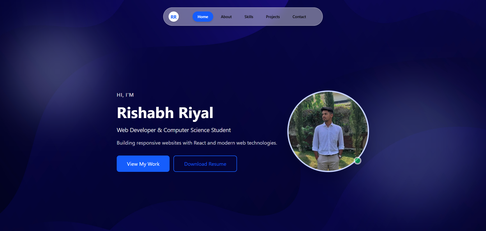

# Portfolio Website



A modern and responsive portfolio website built with React and Vite, showcasing professional experience, projects, and skills. This portfolio features a dynamic interface with custom background images, interactive components, and seamless navigation.

## 🚀 The website is live at:

``` 
https://rishabh-riyal-portfolio.vercel.app
```

## 📌 About

This portfolio website serves as a comprehensive platform to showcase my professional journey as a Web Developer and Computer Science student. Built with modern web technologies, it features:

- **Hero Section**: Eye-catching introduction with custom background and responsive design
- **About Me**: Professional overview with skills categorization (Frontend/Backend)
- **Technical Skills**: Interactive skill cards with transparent overlays and custom backgrounds
- **Education Timeline**: Academic journey with visual indicators
- **Projects Gallery**: Dynamic GitHub integration displaying live repositories
- **Interests & Passions**: Creative showcase of personal interests
- **Certifications**: Professional achievements with direct certificate links
- **Contact Form**: Interactive contact section for professional inquiries

## 🚀 Technologies Used

- **Frontend**: React 18, Vite 5
- **Styling**: TailwindCSS 3 with custom responsive design
- **Build Tools**: Vite for fast development and optimized builds
- **Code Quality**: ESLint for maintaining code standards
- **APIs**: GitHub API integration for dynamic project fetching
- **Deployment**: Vercel for seamless hosting

## ✨ Key Features

### Design & UI/UX
- **Responsive Design**: Fully optimized for mobile, tablet, and desktop
- **Custom Backgrounds**: Hero and skills sections with custom imagery
- **Glass Morphism**: Transparent navbar with backdrop blur effects
- **Interactive Elements**: Hover effects, smooth transitions, and animations
- **Color Palette**: Consistent indigo/blue theme throughout

### Functionality
- **Dynamic Projects**: Real-time GitHub repository integration
- **Smooth Navigation**: Floating navbar with active section highlighting
- **Mobile-First**: Hamburger menu and responsive components
- **Performance Optimized**: Lazy loading and optimized asset delivery
- **SEO Ready**: Proper meta tags and semantic HTML structure

### Components Architecture
- **Modular Design**: Reusable components (Navbar, Footer, SectionTitle)
- **Utility Functions**: Custom scroll utilities and GitHub API handlers
- **State Management**: React hooks for interactive features
- **Error Handling**: Graceful fallbacks for API failures

## 🛠️ Installation

1. Clone the repository:
```bash
git clone https://github.com/rishabhriyal112/Portfolio-Website.git
```

2. Navigate to the project directory:
```bash
cd Portfolio-Website
```

3. Install dependencies:
```bash
npm install
```

## 🚦 Running the Project

### Development Mode
To run the project in development mode with hot-reload:
```bash
npm run dev
```

### Building for Production
To create a production build:
```bash
npm run build
```

### Preview Production Build
To preview the production build locally:
```bash
npm run preview
```

## 🧪 Code Quality

### Linting
To run the linter:
```bash
npm run lint
```

### Code Review Findings
Recent code analysis revealed:
- **Performance**: Optimizations needed for inline styles and array recreations
- **Error Handling**: Enhanced error handling for API calls and form submissions
- **Maintainability**: Component extraction opportunities for better modularity

## 📁 Project Structure

```
portfolio_website/
├── public/
│   └── Interface.png       # Portfolio preview image
├── src/
│   ├── assets/
│   │   └── images/         # Custom backgrounds and profile images
│   │       ├── hero_background.jpg
│   │       ├── technical_skills.jpg
│   │       └── rishabh01.jpg
│   ├── components/         # Reusable React components
│   │   ├── AboutSection.jsx
│   │   ├── Avatar.jsx
│   │   ├── ContactSection.jsx
│   │   ├── Footer.jsx
│   │   ├── HeroSection.jsx
│   │   ├── Navbar.jsx
│   │   ├── ProjectCard.jsx
│   │   ├── SectionTitle.jsx
│   │   └── SkillCard.jsx
│   ├── utils/              # Utility functions
│   │   ├── githubApi.js    # GitHub API integration
│   │   └── scrollUtils.js  # Smooth scrolling utilities
│   ├── App.jsx             # Main application component
│   ├── App.css             # Component styles
│   ├── index.css           # Global styles and Tailwind imports
│   └── main.jsx            # Application entry point
├── index.html              # HTML entry point
├── vite.config.js          # Vite configuration
├── eslint.config.js        # ESLint configuration
├── tailwind.config.js      # TailwindCSS configuration
├── postcss.config.js       # PostCSS configuration
└── package.json            # Project dependencies and scripts
```

## 🎨 Design System

### Color Palette
- **Primary**: Indigo/Blue gradient theme
- **Backgrounds**: Custom images with overlay effects
- **Text**: High contrast for accessibility
- **Accents**: Consistent blue tones throughout

### Typography
- **Responsive**: Mobile-first text sizing
- **Hierarchy**: Clear heading structure
- **Readability**: Optimized line heights and spacing

### Layout
- **Grid System**: TailwindCSS responsive grid
- **Spacing**: Consistent padding and margins
- **Breakpoints**: Mobile, tablet, and desktop optimized

## 🔧 Dependencies

### Core Dependencies
- **react**: ^18.3.1
- **react-dom**: ^18.3.1

### Development Dependencies
- **@vitejs/plugin-react**: ^4.3.4
- **vite**: ^5.4.10
- **eslint**: ^9.13.0
- **tailwindcss**: ^3.4.14
- **autoprefixer**: ^10.4.20
- **postcss**: ^8.4.49

## 🚀 Deployment

The website is deployed on Vercel with:
- **Automatic Deployments**: Connected to GitHub for CI/CD
- **Performance Optimization**: Edge network delivery
- **Custom Domain**: Professional URL structure
- **Analytics**: Built-in performance monitoring

## 🤝 Contributing

1. Fork the repository
2. Create your feature branch (`git checkout -b feature/amazing-feature`)
3. Commit your changes (`git commit -m 'Add some amazing feature'`)
4. Push to the branch (`git push origin feature/amazing-feature`)
5. Open a Pull Request

## 📝 License

This project is open source and available under the [MIT License](LICENSE).

## 📧 Contact

**Rishabh Riyal**
- Email: riyalrishabh22@gmail.com
- LinkedIn: [rishabh-riyal-6a1567323](https://www.linkedin.com/in/rishabh-riyal-6a1567323/)
- GitHub: [rishabhriyal112](https://github.com/rishabhriyal112)

---

⭐ If you found this project helpful, please give it a star!